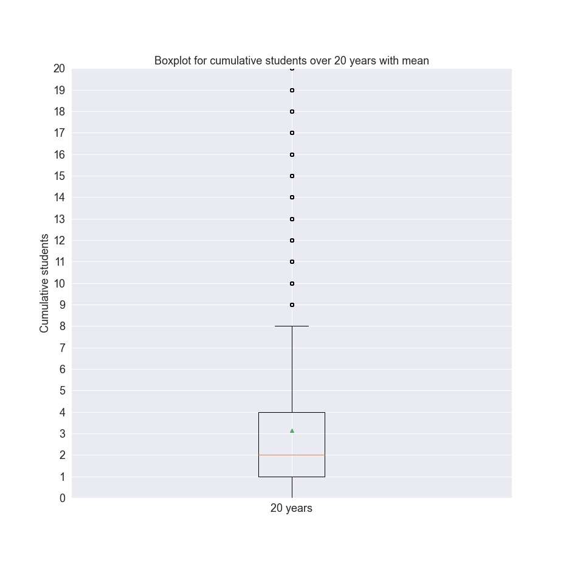

# Math_PhD_Students_ML_Project

Scott Atkinson

## [0. Contents](#0._Contents) 

## [1. Introduction](#1._Introduction)

## [2. Data Wrangling](#2._Data_Wrangling)

* ### [2.0. Data Sources](#2.0._Data_Sources)
* ### [2.1. Data Cleaning](#2.1._Data_Cleaning)

## [3. EDA](#3._EDA)

## [4. Preprocessing](#4._Preprocessing)

## [5. Modeling](#5._Modeling)

## [6. Report](#7._Report)

## 1. Introduction

What is a sign of a healthy vibrant mathematics department?  For PhD-granting departments, one of the best indicators of the rank and prestige of the department is the quality of their PhD program.  Consistently producing PhD graduates is a sign of a healthy department and attracts more PhD students which raises both the revenue and profile of the department.  Keeping graduate student offices full of PhD students provides the department with fresh ideas and energy.  Advising PhD students motivates faculty members to remain in touch with the frontiers of their research areas. A faculty member who can attract, mentor, and graduate PhD students on a regular basis is extremely valuable to a department.  So any PhD-granting department would want to hire faculty members who possess great advising potential.  Any department looking to hire a new faculty member would take into serious consideration the advising capabilities of their candidates.  Each year mathematics departments in colleges and universities across the world spend significant amounts of time sifting through hundreds of applications for faculty positions. The purpose of this project is to develop classification models to aid departments in narrowing their searches down to only the highest quality candidates. 

We will present two models in this project.  The first model can be considered as a **highlighter** model.  That is, it will identify extremely strong candidates by predicting if a candidate will produce at least 5 students during the first twenty years of the candidate's career.  The data show that only 22.2\% of all advisors (active for at least twenty years) have graduated at least 5 students in their first twenty years.  Thus 5 students in twenty years sets the bar high. The second model is a **screen** model.  The screen model will predict if a candidate will produce at least 2 students during the first twenty years of the candidate's career.  The data show that 2 students in twenty years is the median amount of students for that time interval.  More specifically, 55\% of all advisors (active for at least twenty years) have graduated at least 2 students in their first twenty years.  So a department may not want to consider any candidates with advising potential predicted to be below the median.

## 2. Data Wrangling

### 2.0. Data Sources

The data for this project are obtained from two sources: [The Mathematics Genealogy Project](https://genealogy.math.ndsu.nodak.edu/index.php) and [MathSciNet](https://mathscinet.ams.org/mathscinet/index.html).  The Mathematics Genealogy Project maintains a database of mathematics PhDs, typically recording a mathematician's school, graduation year, thesis title, advisor, and any PhD students they themselves advised.  MathSciNet is a database of mathematics publications.  MathSciNet maintains author pages for each author in the database.  These author pages include relevant data such as total publications, total citations, and collaborators.  While full access to MathSciNet requires a subscription, the data obtained from MathSciNet for this project are publicly available.

### 2.1. Data Cleaning

Following webscraping, the collected data were processed and cleaned in [this notebook](https://github.com/scatkinson/Math_PhD_Students_ML_Project/blob/main/MGPDataWrangling.ipynb). You can view the steps taken in the above linked notebook.  The [report](https://github.com/scatkinson/Math_PhD_Students_ML_Project/blob/main/Report/Math_PhD_Students_ML_Project_Report.pdf) also contains a brief description of some of the data cleaning steps.

## 3. EDA

Exploratory data analysis is performed in [this notebook](https://github.com/scatkinson/Math_PhD_Students_ML_Project/blob/main/MathPhD_EDA.ipynb), and further data analysis is performed in [this notebook](https://github.com/scatkinson/Math_PhD_Students_ML_Project/blob/main/Data%20Storytelling.ipynb).  The [report](https://github.com/scatkinson/Math_PhD_Students_ML_Project/blob/main/Report/Math_PhD_Students_ML_Project_Report.pdf) provides an account of how this analysis was incorporated into the project.  As mentioned in the [introduction](#1._Introduction), we will produce two classification models to predict whether or not a mathematics faculty candidate will produce at least 2 or 5 PhD graduates. The following boxplot for the number of students produced in 20 years was one of the more useful plots because it provided a nice guide for which thresholds for the number of students produced to use in our predictions. 

Since 2 is the median of the distribution for the number of students produced in 20 years, it will serve as a good threshold for screening out bad candidates using our Screen model.  The boxplot also indicates that 5 lies above the interquartile range for the same distribution, making it a good threshold for identifying especially strong candidates using our Highlighter model.

We also perform logistic regression analysis to get an idea of the influence of variables.  The following charts indicate the variable importances for each model.

## 4. Preprocessing

The preprocessing steps can be found in [this notebook](https://github.com/scatkinson/Math_PhD_Students_ML_Project/blob/main/MathPhD%20Preprocessing%20and%20Modeling.ipynb).  These steps include making target variables for predicting at least 2 and at least 5 students, getting dummy variables for the School variable, and producing indicator variables for subject areas.

## 5. Modeling

The modeling steps are performed in the same [notebook](https://github.com/scatkinson/Math_PhD_Students_ML_Project/blob/main/MathPhD%20Preprocessing%20and%20Modeling.ipynb) as the preprocessing steps.  For each target variable, we perform a 75/25 stratified train-test-split followed by a grid search/random search cross-validation for four classifiers: `RandomForestClassifier`, `AdaBoostClassifier`, `GradientBoostingClassifier`, and `MLPClassifier`.  See the [report](https://github.com/scatkinson/Math_PhD_Students_ML_Project/blob/main/Report/Math_PhD_Students_ML_Project_Report.pdf) to view the results of these cross-validations.  Using the hyperparameters selected by our cross-validations, we then set out to tune the thresholds based on the usage of our model.  Both uses of the Screen and Highlighter models justify heavy emphasis on positive precision.  The following precision-recall curves indicate the selected thresholds for both models.

 model")

 model")

The confusion matrices for these estimators and thresholds can also be found in the [report](https://github.com/scatkinson/Math_PhD_Students_ML_Project/blob/main/Report/Math_PhD_Students_ML_Project_Report.pdf).

## 6. Report

We provide an account of the process and results of this project in the [report](https://github.com/scatkinson/Math_PhD_Students_ML_Project/blob/main/Report/Math_PhD_Students_ML_Project_Report.pdf).  A [slide version](https://github.com/scatkinson/Math_PhD_Students_ML_Project/blob/main/Report/Math_PhD_Students_ML_Project_Report_Slides_webversion.pdf) of the report is also available.

### Acknowledgment

I would like to thank my Springboard mentor Ben Bell for helpful guidance during the completion of this project.